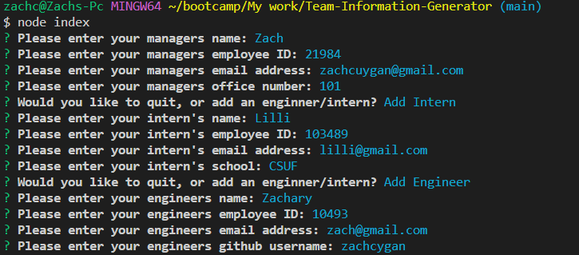
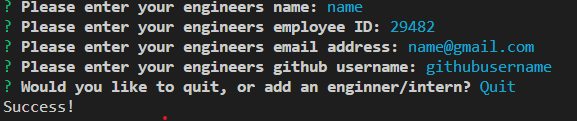
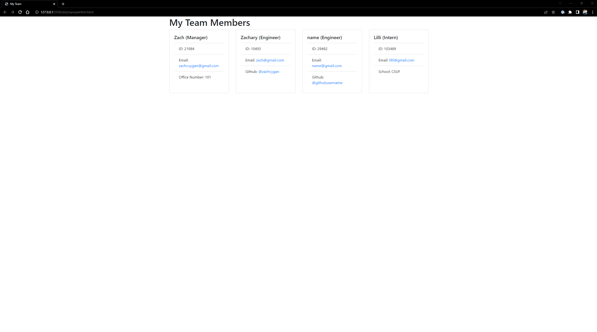

# Team-Information-Generator

## Description

My motivation for this project was to make a simple program that compiled a dev teams manager, engineers, and interns information to be easily accessible to anybody. 

## Installation

The webpage is available at https://github.com/zachcygan/Team-Information-Generator. Be sure to install any dependencies by typing in "npm i" in the console. This will install inquirer, jest, and open. 

## Dependencies Used
    - inquirer
    - jest
    - open

## Instructions

To begin installing the program, to be sure to type "npm i" inside the terminal to install any dependencies. To run the program type, "node index.js" inside the terminal. This will begin asking the user for a managers name, 
employee id,email, and office number. It will then prompt the user if they wish to add an engineer or intern, of if they wish to quit. If engineer is chose, it will prompt the user from their name, employee id, email, and
github username. IIf intern is selected it will prompt the user for the interns name, employee id, email, and school. This process will repeat until the user wishes to quit the program, at which point an index.html
file will be generated and opened automatically with cards that contain the teams information. Clicking on an email will open your default mailing app with an email create to that email. Similarly, clicking on an engineers github username will take you to that users github profile.

## Tests

To run the tests for the program, simply type "npm run test" in the console of one of the four test files. There are 4 test suites and 19 tests total. All tests should pass. 

## Video Demo

A video demonstration of this program can be found here: https://youtu.be/ISZuIq-8PzE. 

## Screenshots

